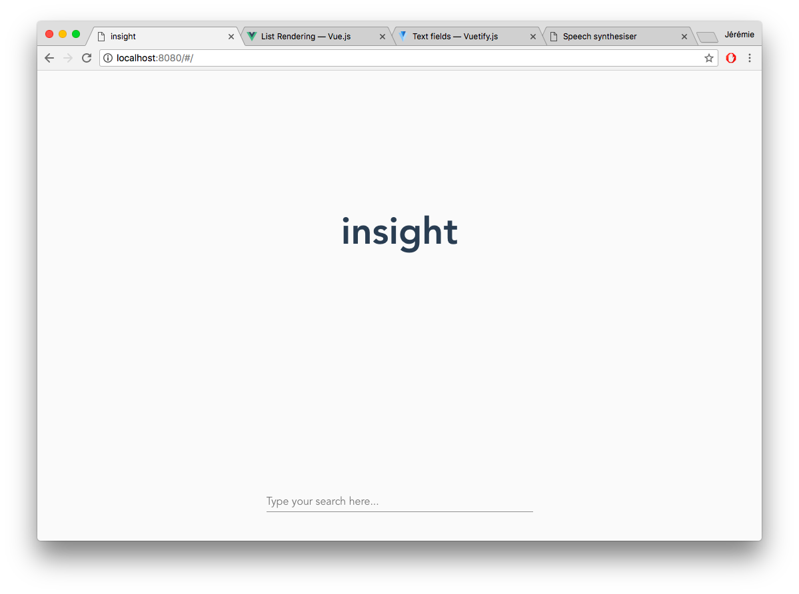

# insight
> Knowledge modernized

## Screenshots



## What is it ?

It's an automated wikipedia exposé. It presents you information in an interactive way.

## Build Setup

This project is created with [Vue.js](https://vuejs.org).

``` bash
# install dependencies
npm install

# serve with hot reload at localhost:8080
npm run dev

# build for production with minification
npm run build

# build for production and view the bundle analyzer report
npm run build --report

# run unit tests
npm run unit

# run all tests
npm test
```

For a detailed explanation on how things work, check out the [guide](http://vuejs-templates.github.io/webpack/) and [docs for vue-loader](http://vuejs.github.io/vue-loader).

## Used APIs/sources

### Wikimedia

* [Wikimedia API Properties](https://www.mediawiki.org/wiki/API:Properties#revisions_.2F_rv)
* [Wikimedia search API](https://www.mediawiki.org/wiki/API:Search)
* [Wikimedia REST API](https://en.wikipedia.org/api/rest_v1/#/)
* [Wikimedia - Extend search results](https://www.mediawiki.org/wiki/API:Page_info_in_search_results)
* [Wikimedia API: Query](https://www.mediawiki.org/wiki/API:Query)
* [Browser speech synthesis](https://developer.mozilla.org/en-US/docs/Web/API/SpeechSynthesis)
